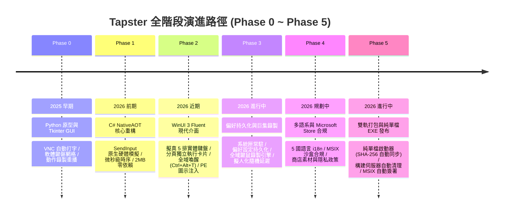

# Tapster 發展規劃 (Roadmap & Milestones)

**專案定位**：Windows 11 現代化鍵鼠輸入自動化控制台（WinUI 3 + C# .NET Native）  
**目標期程**：2025年 — 2026年  
**參考標準**：借鑑 Clickra 企業級架構、MSIX 雙軌發布與 Microsoft Store 上架規範  

---

## 總覽與全景時間軸 (Overview & Timeline)



### 世代演進對照表

| 階段代號 | 版本定位 | 核心技術 | 介面型態 | 體積 / 記憶體 | 狀態 |
|---|---|---|---|---|---|
| **Phase 0** | Python 舊版原型 | Python 3 + `keyboard` + `ctypes` | Tkinter 多頁籤 GUI | ~8MB / ~45MB | 已完成 ✅ (封存) |
| **Phase 1** | Native 底層核心 | C# .NET 8 + Win32 `SendInput` | 輕量命令列 (CLI) | ~2-3MB / ~8MB | 已完成 ✅ |
| **Phase 2** | Fluent 現代介面 | WinUI 3 + Windows App SDK | 現代 Windows 11 GUI | 獨立發布 / ~35MB | 已完成 ✅ (現行) |
| **Phase 3** | 進階自動化與錄製 | C# .NET + Win32 Hooks + Tray | Fluent GUI + 獨立控制卡片 | 獨立發布 / ~35MB | 進行中 🚧 |
| **Phase 4** | Store 上架合規 | C# .NET + MSIX Sandboxed | 5 國多語系 Fluent GUI | MSIX 商店套件 | 規劃中 📌 |
| **Phase 5** | 雙軌發行與自動化 | Single-File Launcher + MSIX | 雙軌（Store + Portable EXE） | 雙軌自動分發 | 進行中 🚧 |

---

## 統一演進階段與功能規格 (Phases & Feature Specs)

### [Phase 0] Python 原型與 VNC 自動化 (Legacy) — `已完成 ✅`
> **背景痛點**：遠端 VNC、虛擬機器與受限沙盒環境封鎖本機剪貼簿同步，需要將文字模擬鍵擊打入視窗，並解決防閒置斷線與重複點擊需求。

- [x] **[P0-1] VNC Auto Typer 原型 (`tapster_cli.py`)**
  - **規則**：以實體鍵擊事件（Keystroke）逐字模擬打入文字，繞過剪貼簿同步限制。支援啟動倒數延遲（`--delay`）與打字間隔（`--interval`）。
- [x] **[P0-2] 基礎按鍵長按與連點器 (`tapster_cli.py`)**
  - **規則**：支援單鍵長按指定秒數（`--duration`）或無限長按；連點器透過 Windows `mouse_event` 實作左/中/右鍵連點與 `--pick` 互動式座標取點。
- [x] **[P0-3] Tkinter 暗色系多頁籤 GUI (`tapster_gui.py`)**
  - **Auto Typer**：多行輸入框、一鍵貼入剪貼簿、打字速度調整、歷史記錄持久化（`~/.tapster_history.txt` 雙擊載入）。
  - **Key Holder**：首創軟體鍵盤網格、實體按鍵捕捉（`⏺ Capture Keys`）、複合鍵組合（如 `Ctrl+Shift+Esc`）、3 種長按模式（無限/計時/按鍵輪替 Rotation）。
  - **Auto Clicker**：單純連點（次數限制/無限、連點時按住 `Hold key` 修飾鍵）與鍵鼠動作時序錄製回放（Record & Replay，支援 0.1x~5x 變速）。
- [x] **[P0-4] 全域安全防護機制**
  - **規則**：視窗「永遠置頂 (Always on Top)」防遮擋；全域 `Esc` 緊急中止並呼叫 `_release_modifiers` 強制釋放 Shift/Ctrl/Alt/Win 防止按鍵卡死。
- [x] **[P0-5] 輕量化白名單打包 (`Tapster_Lite.spec`)**
  - **規則**：客製化 PyInstaller spec 排除無用標準庫與 PyQt5，將產出壓縮至 ~8MB 獨立執行檔。

---

### [Phase 1] C# NativeAOT 核心重構 (Native Core) — `已完成 ✅`
> **背景痛點**：徹底消除 Python 直譯器依賴、消除防毒軟體誤報、降低記憶體佔用至 10MB 以下，並將計時精確度推至微秒級。

- [x] **[P1-1] 零依賴底層引擎解耦 (`src/Tapster/`)**
  - 建立專屬核心函式庫 `Tapster.Core`，採用標準 Win32 P/Invoke 封裝 `SendInput` API。
- [x] **[P1-2] 高精度輸入模擬器 (`Keyboard.cs` & `Mouse.cs`)**
  - **鍵盤規則**：支援 Virtual-Key 碼與 Unicode UTF-16 字元直投（`KEYEVENTF_UNICODE`），免切換中/英輸入法即可準確打字。
  - **滑鼠規則**：螢幕絕對座標正規化映射（0~65535 座標轉換）與精確按鍵 Down/Up 控制。
  - **安全規則**：`Keyboard.ReleaseAllModifiers()` 在任務啟動前、結束後強制釋放所有修飾鍵。
- [x] **[P1-3] 四大結構化自動化執行器**
  - `AutoTyper.cs`：高精度非同步打字循環，支援 `CancellationToken` 立即取消。
  - `AutoClicker.cs`：微秒級連點循環，最小間隔達 1ms。
  - `KeyHolder.cs`：單鍵與多鍵組合長按，支援計時倒數與無限保持。
  - `MacroRecorder.cs`：基於 `Stopwatch` 微秒級高解析時序記錄器，支援鍵鼠混合動作錄製與變速回放。
- [x] **[P1-4] 原生 CLI 工具 (`Tapster.Cli`)**
  - 支援 NativeAOT 編譯，產出體積僅約 2-3MB 的超輕量零依賴執行檔。

---

### [Phase 2] WinUI 3 Fluent 現代介面 (Fluent Desktop) — `已完成 ✅ (現行版本)`
> **背景痛點**：對齊 Windows 11 Fluent Design System 視覺標準，修復各類 UI 渲染與視窗拖曳瑕疵。

- [x] **[P2-1] WinUI 3 + Windows App SDK 現代架構**
  - 導入 Mica 背景材質、NavigationView 側邊導航、Card 卡片式佈局與深淺主題切換。
- [x] **[P2-2] 擬真 5 排實體虛擬鍵盤 (Realistic Physical Keyboard)**
  - **佈局規則**：完整重構為標準實體鍵盤 5 排結構：
    - **F 鍵排**：Esc (Accent 亮色) + F1-F4 (間隔) + F5-F8 (間隔) + F9-F12。
    - **數字排**：`~` 1-0 `-` `=` + `Backspace` (76px)。
    - **QWERTY 排**：`Tab` (54px) + QWERTYUIOP `[` `]` `\`。
    - **Home 排**：`Caps Lock` (66px) + ASDFGHJKL `;` `'` + `Enter` (80px 亮色)。
    - **Shift 排**：`Shift` (88px) + ZXCVBNM `,` `.` `/` + `Shift` (92px)。
    - **Bottom 排**：Ctrl/Win/Alt + `Space` (240px 超長鍵) + 方向鍵叢集 (`◄` `▲` `▼` `►`)。
  - **樣式規則**：每顆按鍵具備 Keycap 圓角立體外框與 Cascadia Code 等寬字型。
- [x] **[P2-3] 視窗流暢拖曳修復 (TitleBar Drag Optimization)**
  - **規則**：建立獨立的 `TitleBarDragRegion` 透明拖曳區，將 `SetTitleBar` 與標題列內的按鈕（如 AlwaysOnTop 勾選框）徹底解耦，消除拖曳卡頓。
- [x] **[P2-4] 符號渲染規範化 (Clean Fluent Glyphs)**
  - **規則**：移除 TextBlock 內混用 Emoji 導致渲染出藍色小方塊的瑕疵，統一使用 Microsoft Segoe Fluent Icons 動態 Glyph (`\uE7C8` 錄製、`\uE71A` 停止、`\uE707` 十字準星、`\uE765` 打字機)。
- [x] **[P2-5] 全域喚醒快捷鍵 (Global Wake Hotkey)**
  - **規則**：透過 Win32 `RegisterHotKey` 註冊 **`Ctrl + Alt + T`**，任何時候按下皆能將視窗從最小化/背景拉至最前端並取得焦點。
- [x] **[P2-6] PE 資源注入修復 (Win32 Resource Injection)**
  - **規則**：實作 `UpdateIcon.ps1` Post-build 目標，在編譯完成後直接透過 Win32 `kernel32!UpdateResource` 將 `app.ico` 嵌入 EXE 的 PE 資源區段，並在 `MainWindow` 初始化呼叫 `AppWindow.SetIcon()`，修復檔案總管與工作列圖示。
- [x] **[P2-7] 分頁獨立自治控制卡片 (Self-Contained Per-Panel Execution Cards)**
  - **規則**：移除全域底欄，將啟動延遲（`Delay (s)`）、毫秒/字元/點擊即時進度條與 `[ Start / Stop ]` 按鈕直接內嵌於各功能（Typer, Holder, Clicker, Macro）卡片底部；徹底避免跨頁執行時的認知混淆，並使 Settings 與 About 分頁呈現純粹專屬視圖。
- [x] **[P2-8] 單鍵捕捉全域掃描 (Full Virtual-Key Capture)**
  - **規則**：實作全域 0x08~0xFE 虛擬鍵盤掃描機制，點擊「Capture Key」後可在任意視窗按下實體鍵並自動轉換為友善按鍵名稱。
- [x] **[P2-9] 關於分頁與規格展示 (About & Technical Specs)**
  - **規則**：於導航列底部加入 About 專屬頁面，呈現 Hero Logo 卡片、版本號標籤、底層技術規格矩陣、100% 離線隱私聲明，以及一鍵開啟 `%LOCALAPPDATA%\Tapster\` 設定目錄。

---

### [Phase 3] 偏好持久化與進階自動化 (Advanced Features) — `進行中 🚧`
> **目標**：增強實用度，提供設定儲存、腳本匯入匯出、隨機延遲與背景迷你操作模式。

- [ ] **[P3-1] 巨集腳本 JSON 匯出與匯入 (Macro JSON Schema)**
  - **規格**：定義標準巨集 JSON 格式，支援將錄製好的動作序列儲存為 `.tapster` 檔案，方便分享、編輯與備份。
- [x] **[P3-2] 使用者偏好設定持久化與開機自動啟動 (Settings Persistence & Windows Startup)**
  - **規則**：於 NavigationView 左下角新增 Settings 設定分頁；支援「開機自動啟動 (Start with Windows)」、「啟動時自動縮小至系統匣」、「點擊關閉 (X) 時縮至系統匣」之開關切換；設定自動序列化儲存至 `%LOCALAPPDATA%\Tapster\settings.json`。
- [x] **[P3-3] 系統匣常駐與右鍵選單 (System Tray & Background Resident)**
  - **規則**：透過 Win32 `Shell_NotifyIconW` 與 Window Subclassing 實作零依賴系統匣圖示；支援 `--tray` 啟動隱藏常駐、雙擊喚醒、視窗關閉縮排至系統匣，以及包含「顯示/隱藏」、「永遠置頂」、「結束」的原生右鍵彈出式選單。
- [x] **[P3-4] 背景巨集錄製引擎 (Macro Recorder Engine)**
  - **規則**：基於 Win32 `GetAsyncKeyState` 狀態機與相對毫秒時間戳捕捉鍵盤與滑鼠點擊動作，支援即時動作捕獲回調、符號位元跨執行緒安全判定與多倍速回放。
- [ ] **[P3-5] 擬人化隨機延遲 (Humanized Jitter & Anti-Detection)**
  - **規格**：在打字與連點間隔中加入可配置的正態分佈隨機波動（Jitter ±5~15%），模擬真人手速，防止機械式操作判定。
- [ ] **[P3-6] 智慧像素 / 影像顏色條件觸發 (Pixel & Image Trigger)**
  - **規格**：偵測指定螢幕座標之像素顏色或區域特徵，符合條件時自動觸發連點或巨集。

---

### [Phase 4] 多語系與 Microsoft Store 上架合規 (Store Readiness & i18n) — `規劃中 📌`
> **目標**：對齊微軟商店政策（Microsoft Store Policies），通過自動化與人工審核並上架。

- [ ] **[P4-1] 5 國語言原生本地化支援 (Multi-language i18n)**
  - **規格**：導入 WinUI 3 `Resources.resw` 標準多語系架構，支援動態語系切換：
    - 繁體中文 (`zh-TW`)
    - 英文 (`en-US`)
    - 簡體中文 (`zh-CN`)
    - 日本語 (`ja-JP`)
    - 韓語 (`ko-KR`)
- [x] **[P4-2] MSIX 封裝與自動簽署 (MSIX Packaging & Signing)**
  - **規則**：建立 `packaging/msix/AppxManifest.xml`（宣告 `runFullTrust`）與全套視覺資產；實作 `scripts/build_msix.ps1` 透過 `makeappx.exe` 打包與 `signtool.exe` 自動化測試憑證簽署，產出標準 `.msix` 安裝套件（33.9MB）。
- [ ] **[P4-3] Microsoft Store 文案與上架素材 (Store Listings & Assets)**
  - **規格**：撰寫 5 國語言商店文案、準備 1920x1080 高解析功能截圖；建立正式隱私權政策 (`PRIVACY.md`)，聲明「不收集、不傳輸任何使用者按鍵記錄，100% 本機處理」。

---

### [Phase 5] CI/CD 自動化與雙軌發布 (Release Automation) — `進行中 🚧`
> **目標**：比照 Clickra 建立全自動化構建、簽署、發布管線與雙軌發行模式。

- [ ] **[P5-1] GitHub Actions 自動化建置管線 (`.github/workflows/build.yml`)**
  - **規格**：在 Windows Runner 上自動編譯 `Tapster.Fluent` 與 `Tapster.Core`，執行單元測試與品質檢查。
- [x] **[P5-2] 純單檔可攜式啟動器與自動同步 (`Tapster.Launcher`)**
  - **規則**：實作純單一 `.exe` 啟動器（43.1MB），內建 Payload 解壓、SHA-256 特徵碼比對自動同步機制；更新前自動平穩釋放舊程序以防止 DLL 檔案鎖定，並支援單一實例智慧喚醒。
- [x] **[P5-3] 編譯程序防護與構建伺服器清理 (Build Process Guard & Server Shutdown)**
  - **規則**：全域關閉 MSBuild NodeReuse 與 SharedCompilation，在所有打包腳本加入 `finally { Stop-BuildServers }` 自動關閉伺服器防殘留，確保使用者開發環境 100% 乾淨無背景 `.NET Host` 佔用。
- [x] **[P5-4] 雙軌發行架構 (Dual-Track Distribution)**
  - **軌道 A (Store / 一般用戶)**：`Tapster (WinUI 3 Fluent MSIX)` 具備現代美觀介面、自動依賴管理與沙盒安全性。
  - **軌道 B (可攜式 / 綠色免安裝)**：`Tapster Portable (True Single-File EXE)` 真正純單一 `.exe` 檔案，解壓即跑、零依賴、零報錯。
- [ ] **[P5-5] Microsoft Store Submission API 自動發布**
  - **規格**：透過 Azure AD 認證，在建立 Git Release Tag 時自動上傳 MSIX 至 Partner Center 審核隊列。

---

## 專案架構與品質規範 (Architecture & Quality Gates)

```
Script-List/automation/
├── tapster/                      # [Legacy] Python 原版 (已封存為歷史參考)
│   ├── tapster_cli.py
│   ├── tapster_gui.py
│   └── Tapster_Lite.spec
│
└── tapster-native/               # [Active] 現代化 Native 解決方案
    ├── Tapster.sln
    ├── Directory.Build.props     # MSBuild 全域防護 (NodeReuse=false)
    ├── docs/
    │   └── ROADMAP.md            # 本發展藍圖文件
    ├── src/
    │   ├── Tapster/              # [Tapster.Core] 零依賴底層自動化引擎 (.NET 8/10)
    │   │   ├── AutoTyper.cs
    │   │   ├── AutoClicker.cs
    │   │   ├── KeyHolder.cs
    │   │   ├── MacroRecorder.cs
    │   │   ├── Keyboard.cs
    │   │   ├── Mouse.cs
    │   │   └── NativeMethods.cs
    │   │
    │   └── Tapster.Launcher/     # [Tapster.Launcher] 純單檔啟動器 (SHA-256 自動同步)
    │       ├── Program.cs
    │       └── Tapster.Launcher.csproj
    │
    └── Tapster.Fluent/           # [Tapster.Fluent] WinUI 3 現代化桌面應用程式
        ├── Assets/               # 高解析圖示與向量資源
        ├── MainWindow.xaml(.cs)  # 標題列拖曳、置頂與全域喚醒控制
        ├── MainPage.xaml(.cs)    # 5 排實體虛擬鍵盤、各分頁獨立控制卡片、關於頁
        ├── AppSettings.cs        # 偏好設定持久化 (%LOCALAPPDATA%\Tapster\settings.json)
        ├── UpdateIcon.ps1        # Post-build Win32 PE 資源注入腳本
        └── Tapster.Fluent.csproj # 專案設定與自動化構建目標
```

### 品質與設計原則
1. **零多餘依賴 (Zero Bloat)**：`Tapster.Core` 維持純粹的 Win32 API 呼叫，不引入肥大第三方套件。
2. **極致響應 (Responsive UI)**：所有耗時的自動化打字、連點與巨集回放必須在獨立的非同步線程 (`Task.Run`) 執行，不得阻斷 UI Dispatcher。
3. **無閃爍與高 DPI 支援 (Per-Monitor V2 DPI Awareness)**：WinUI 3 原生支援向量渲染與動態 DPI 縮放，在 100% ~ 300% 縮放下字型與鍵盤網格皆保持像素級銳利。
4. **乾淨發布 (Clean Release Gate)**：發布版本必須維持 **0 警告、0 錯誤**，並保證編譯退出後不殘留任何背景伺服器進程。
